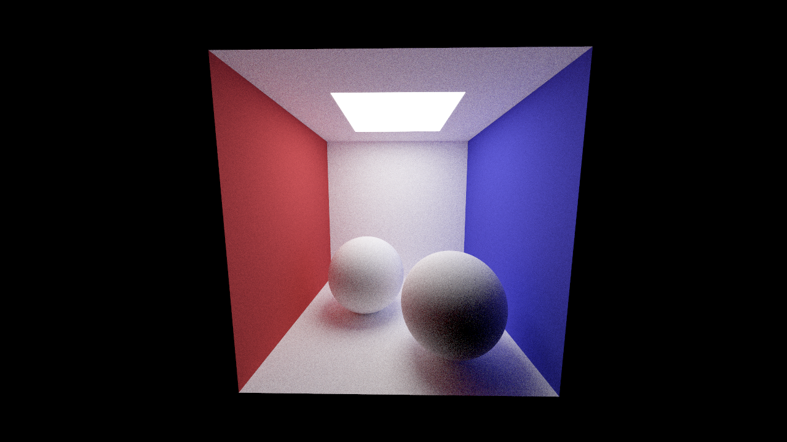

# (Task 4) Path Tracing

Up to this point, your renderer only computes object visibility using ray tracing. Now, we will simulate the complicated paths light can take through the scene, bouncing off many surfaces before eventually reaching the camera. Simulating this multi-bounce light is referred to as _global illumination_, and it is critical to producing realistic images, especially when specular surfaces are present.

---

## Step 1: `Pathtracer::trace`

`Pathtracer::trace` is the function responsible for coordinating the path tracing procedure. We've given you code to intersect a ray with the scene and collect information about the surface intersection necessary for computing the lighting at that point. You should read this function and remove the early-out that colors surfaces based on their normal direction.

## Step 2: `BSDF_Lambertian`

Implement `BSDF_Lambertian::sample`, `BSDF_Lambertian::evaluate`, and `BSDF_Lambertian::pdf`. Note that their interfaces are defined in `rays/bsdf.h`. Task 5 will further discuss sampling BSDFs, so reading ahead may help your understanding.

- `BSDF_Lambertian::albedo` is the ratio of incoming light to reflected light,
  also known as the base color of the Lambertian material.
- `BSDF_Lambertian::sample` randomly samples a direction from a cosine-weighted hemisphere distribution and returns a `Scatter`. You can compute the attenuation component via `BSDF_Lambertian::evaluate`.
- `BSDF_Lambertian::evaluate` computes the ratio of incoming to outgoing radiance given a pair of directions. Traditionally, BSDFs are specified as the ratio of incoming radiance to outgoing _irradiance_, which necessitates the extra `cos(theta)` factor in the rendering equation. In Scotty3D, however, we expect the BSDF to operate only on radiance, so you must scale the evaluation accordingly.
- `BSDF_Lambertian::pdf` computes the PDF for sampling some incoming direction given some outgoing direction. However, the Lambertian BSDF in particular does not depend on the outgoing direction. Since we sampled the incoming direction from a cosine-weighted hemisphere distribution, what is its PDF?

Note: a variety of sampling functions are provided in `student/sampler.cpp`. The Lambertian BSDF includes a cosine-weighted hemisphere sampler `Samplers::Hemisphere::Cosine sampler` (see `rays/bsdf.h`).

## Step 3: `Pathtracer::sample_indirect_lighting`

In this function, you will estimate light that bounced off at least one other surface before reaching our shading point. This is called _indirect_ lighting.

- (1) Randomly sample a new ray direction from the BSDF distribution using BSDF::scatter().
- (2) Create a new world-space ray and call Pathtracer::trace() to get incoming light. You should modify time_bounds so that the ray does not intersect at time = 0. Remember to set the new depth value.
- (3) Compute Monte Carlo estimate of incoming _indirect_ light scaled by BSDF attenuation.

## Step 4: `Pathtracer::sample_direct_lighting`

Finally, you will estimate light that hit our shading point after being emitted from a light source without any bounces in between. For now, you should use the same sampling procedure as `Pathtracer::sample_indirect_lighting`, except for using the _direct_ component of incoming light. Note that since we are only interested in light emitted from the first intersection, we can trace a ray with `depth = 0`.

Note: separately sampling direct lighting might seem silly, as we could have just gotten both direct and indirect lighting from tracing a single BSDF sample. However, separating the components will allow us to improve our direct light sampling algorithm in task 6.

---

## Reference Results

After correctly implementing task 4, your renderer should be able to make a beautifully lit picture of the Cornell Box with Lambertian spheres (`cbox_lambertian.dae`). Below is a render using 1024 samples per pixel (spp):

Note the time-quality tradeoff here. This image was rendered with a sample rate of 1024 camera rays per pixel and a max ray depth of 8. This will produce a relatively high quality result, but will take quite some time to render. Rendering a fully converged image may take a even longer, so start testing your path tracer early!

Thankfully, runtime will scale (roughly) linearly with the number of samples. Below are the results and runtime of rendering the Lambertian cornell box at 720p on a Ryzen 5950x (max ray depth 8):

---

## Extra Credit

- Instead of setting a maximum ray depth, implement un-biased russian roulette for path termination. Though russian roulette will increase variance, use of a good heuristic (such as overall path throughput) should improve performance enough to show better convergence in an equal-time comparison. Refer to [Physically Based Rendering](http://www.pbr-book.org/3ed-2018/) chapter 13.7.
- (Advanced) Implement homogeneous volumetric scattering. Refer to [Physically Based Rendering](http://www.pbr-book.org/3ed-2018/) chapters 11 and 15.
